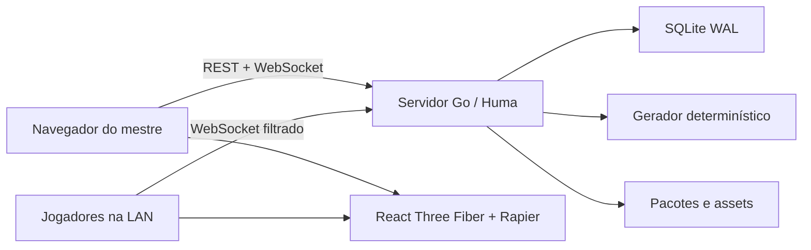

# DDivination

DDivination é um gerador determinístico de aventuras compatíveis com 5E 2024 e
uma VTT 3D local-first. Um único binário Go hospeda a visão do mestre; jogadores
entram pela rede local usando um código temporário.

> O rewrite está em desenvolvimento no branch `rewrite/go-v1`. O MVP anterior
> permanece disponível na tag `legacy-python-mvp`.

## Vertical slice disponível

- geração procedural bilíngue reproduzível por `seed + generatorVersion`;
- mapas com múltiplos andares, salas, corredores, paredes e portais;
- VTT 3D com câmera orbital, instancing, fog manual e tokens no grid;
- sessão LAN com papéis `gm`, `player` e `display`;
- validação autoritativa de movimento e filtragem de conteúdo secreto;
- dados `d4`, `d6`, `d8`, `d10`, `d12`, `d20` e `d100`, com resultado do
  servidor e animação física Rapier;
- iniciativa simples, ping e diário das últimas 100 rolagens no protocolo;
- SQLite em WAL, snapshots, optimistic locking e pacotes `.ddivination`;
- upload validado de PNG, WebP e GLB autocontido;
- enriquecimento narrativo opcional via Responses API, com Structured Outputs,
  chave somente em memória e fallback procedural;
- API OpenAPI 3.1 via Huma e configuração Orval;
- interface em `pt-BR` e `en-US`, sem dependências de rede em runtime.

## Arquitetura



O documento persistido é semântico: tiles, paredes, entidades, salas e
referências de assets. As meshes são derivadas no frontend e nunca entram no
banco.

## Requisitos para desenvolvimento

- Go 1.26;
- Node.js 24;
- npm 11 ou mais recente.

## Executar

Na raiz do repositório:

```powershell
.\scripts\dev.ps1
```

Abra `http://127.0.0.1:5173`. Logs e registros dos processos ficam em
`.tmp/dev-runtime`.

Para encerrar backend e frontend:

```powershell
.\scripts\stop.ps1
```

O servidor permanece restrito ao loopback até o mestre abrir uma sessão; nesse
momento, somente a interface de jogador é exposta nos endereços IPv4 privados.

O `go.work` também permite executar somente o backend a partir da raiz:

```powershell
go run ./apps/server/cmd/ddivination
```

Para servir o build web sem Vite:

```powershell
npm run build:web
$env:DDIVINATION_WEB_DIR = (Resolve-Path "apps/web/dist")
cd apps/server
go run ./cmd/ddivination
```

## Verificação

Suite completa:

```powershell
.\scripts\test.ps1
```

Para omitir apenas o E2E:

```powershell
.\scripts\test.ps1 -SkipE2E
```

Os testes Go verificam determinismo, conectividade de centenas de seeds,
portais, persistência SQLite, optimistic locking, permissões, dados, filtragem
de segredos e segurança de pacotes.

Consulte [docs/TESTING.md](docs/TESTING.md) para detalhes e diagnóstico.

## OpenAPI e cliente TypeScript

Gere o contrato OpenAPI 3.1 e o cliente Orval a partir da fonte Go:

```powershell
.\scripts\generate-contract.ps1
```

Verifique se os artefatos estão sincronizados:

```powershell
.\scripts\check-contract.ps1
```

As operações administrativas existem somente em loopback. A interface LAN
expõe apenas health, entrada e WebSocket de sessão. Consulte
[docs/API.md](docs/API.md) para a matriz completa.

## Build portátil

```powershell
./scripts/build.ps1 -TargetOS windows -TargetArch amd64
```

O script compila o frontend, o incorpora no binário Go e copia
`assets/base-pack` ao lado do executável em `release/`.

## Dados e segurança

- O banco fica no diretório de configuração do usuário, em `DDivination/`.
- `DDIVINATION_DATA_DIR` escolhe um diretório alternativo.
- Códigos de entrada expiram em 15 minutos e tokens de sessão são efêmeros.
- A interface LAN não expõe criação, catálogo, importação ou administração.
- Chaves de IA ainda não são persistidas nem solicitadas pelo vertical slice.
- Imports rejeitam path traversal, entradas excessivas, hashes divergentes,
  formatos não permitidos e GLBs com recursos externos.

## Licenciamento e SRD

O catálogo inicial e as aventuras incluem atribuição ao **System Reference
Document 5.2.1**, de Wizards of the Coast LLC, licenciado sob CC-BY-4.0.
DDivination não é um produto oficial de D&D.

O pack visual inicial contém somente primitivas procedurais originais sob
CC0-1.0. Consulte `assets/base-pack/manifest.json` e `LICENSE.md`.

## Próximos marcos

O vertical slice é funcional, mas o release v1 ainda precisa do editor completo,
regeneração parcial, catálogo SRD ampliado, configuração visual/keychain do
adapter de IA, regressão visual automatizada, validação formal dos budgets de
performance e empacotamento do instalador Windows.
