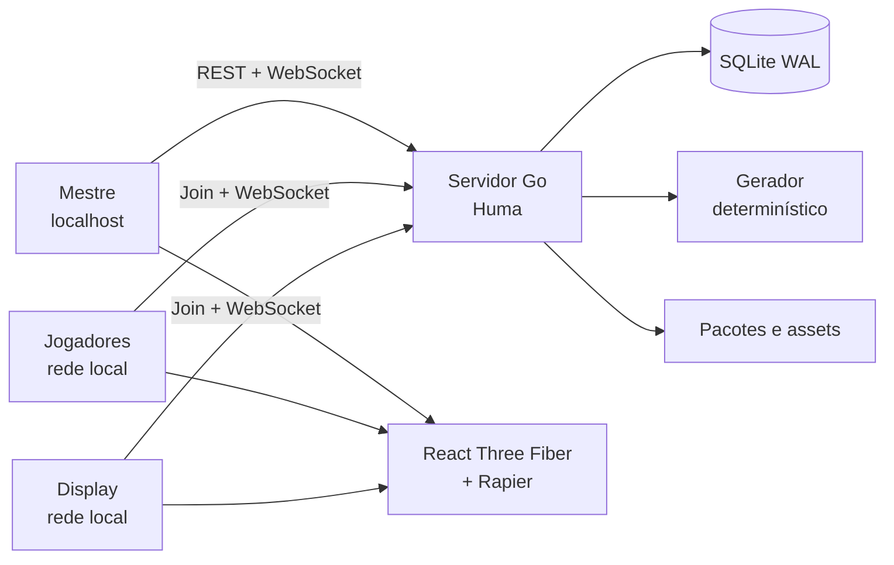

<p align="center">
  
</p>

<h1 align="center">DDivination</h1>

<p align="center">
  <strong>Crie a aventura. Abra a mesa. Explore em 3D.</strong>
</p>

<p align="center">
  Gerador determinístico de aventuras compatíveis com 5E 2024 e VTT 3D
  local-first para mestres e jogadores na mesma rede.
</p>

<p align="center">
  <a href="https://github.com/EmanuelSena101/DDivination/actions/workflows/ci.yml">
    
  </a>
  
  
  
</p>

<p align="center">
  <a href="#início-rápido">Início rápido</a> ·
  <a href="#sua-primeira-aventura">Primeira aventura</a> ·
  <a href="#abrindo-uma-mesa-na-rede-local">Mesa LAN</a> ·
  <a href="#testes">Testes</a> ·
  <a href="#problemas-comuns">Problemas comuns</a>
</p>

> [!IMPORTANT]
> O DDivination ainda está em desenvolvimento. O vertical slice é funcional,
> mas não existe instalador oficial e o editor completo ainda não está pronto.
> O fluxo recomendado neste momento é Windows + PowerShell.

## O que já funciona

- geração procedural bilíngue e reproduzível por `seed + generatorVersion`;
- dungeons com vários andares, salas, corredores, paredes e portais;
- visualizador 3D com câmera orbital, grid, fog manual e tokens;
- mesa pela rede local com papéis de mestre, jogador e display;
- movimento autoritativo, ping, medição e iniciativa simples;
- dados 3D `d4`, `d6`, `d8`, `d10`, `d12`, `d20` e `d100`;
- histórico das últimas 100 rolagens;
- diagnóstico local de FPS, renderer, cena e WebSocket;
- SQLite, checkpoints, exportações e pacotes `.ddivination`;
- interface em `pt-BR` e `en-US`;
- uso offline sem conta ou serviço externo.

## Início rápido

### 1. Pré-requisitos

Instale:

- [Git](https://git-scm.com/downloads);
- [Go 1.26 ou mais recente](https://go.dev/dl/);
- [Node.js 24 ou mais recente](https://nodejs.org/), com npm 11+;
- Windows PowerShell 5.1 ou PowerShell 7.

Confirme as versões:

```powershell
go version
node --version
npm --version
```

### 2. Baixe o projeto

```powershell
git clone https://github.com/EmanuelSena101/DDivination.git
cd DDivination
```

### 3. Inicie tudo

Na raiz do repositório:

```powershell
.\scripts\dev.ps1
```

Na primeira execução, o script instala as dependências, compila o servidor e
inicia backend e frontend. Ao terminar, ele mostra:

```text
Frontend: http://127.0.0.1:5173
Backend:  http://127.0.0.1:8080
```

Abra [http://127.0.0.1:5173](http://127.0.0.1:5173) no navegador.

### 4. Encerre corretamente

Quando terminar:

```powershell
.\scripts\stop.ps1
```

Esse comando encerra somente os processos registrados pelo DDivination e
preserva os logs para diagnóstico.

## Sua primeira aventura

<p align="center">
  
</p>

1. Escolha tamanho e nível do grupo.
2. Defina duração, quantidade de andares e dificuldade.
3. Descreva tema, bioma, antagonista e objetivo.
4. Escolha uma estrutura linear, ramificada ou labiríntica.
5. Clique em **Divinar dungeon**.

O servidor cria e salva um documento semântico. A cena 3D é derivada de tiles,
paredes, entidades e portais; meshes e buffers gráficos não entram no banco.

### Controles principais da VTT

| Controle | O que faz |
| --- | --- |
| **Andares** | Alterna entre os mapas conectados da aventura. |
| **Medir** | Mede distâncias no grid; cada célula representa 5 pés. |
| **Diagnóstico** | Mostra FPS, P95, draw calls, triângulos e sincronização. |
| **Abrir mesa** | Inicia uma sessão para jogadores na rede local. |
| **Fog** | Revela ou oculta células manualmente; disponível ao mestre. |
| **Ping** | Marca uma posição para os participantes conectados. |
| **Dados** | Rola uma expressão como `1d20`, com resultado do servidor. |
| **Exportar** | Gera pacote, Markdown, página imprimível ou screenshot. |

<p align="center">
  
</p>

## Abrindo uma mesa na rede local

1. Gere uma aventura e clique em **Abrir mesa**.
2. O DDivination mostra um QR code, um código temporário e um endereço LAN.
3. Compartilhe o QR code ou endereço com quem estiver na mesma rede.
4. O jogador informa um nome e entra como **player** ou **display**.
5. O mestre pode movimentar qualquer token. O primeiro jogador recebe o token
   do grupo automaticamente; jogadores controlam somente tokens atribuídos.

O backend continua autoritativo para movimento, fog e dados. Conteúdo secreto é
filtrado no servidor antes de ser enviado ao cliente.

> [!NOTE]
> O servidor começa restrito a `127.0.0.1`. A interface LAN só é ativada quando
> o mestre abre uma mesa e expõe apenas health, entrada e WebSocket da sessão.

## Onde ficam dados e logs

No modo de desenvolvimento:

| Conteúdo | Local padrão |
| --- | --- |
| Banco e assets locais | `.tmp/dev-data` |
| Logs e registro de processos | `.tmp/dev-runtime` |
| Build web | `apps/web/dist` |
| Binários portáteis | `release` |

Para iniciar com outro diretório de dados:

```powershell
.\scripts\dev.ps1 -DataDir ".tmp\campanha-teste"
```

Isso é útil para testar uma campanha nova sem misturar o banco anterior.

## Testes

Encerre o ambiente de desenvolvimento antes do E2E:

```powershell
.\scripts\stop.ps1
```

Execute a suíte completa:

```powershell
.\scripts\test.ps1
```

Atalhos úteis:

```powershell
# Ignora somente o Playwright
.\scripts\test.ps1 -SkipE2E

# Reutiliza node_modules já instalado
.\scripts\test.ps1 -SkipInstall

# Verifica OpenAPI e cliente TypeScript
.\scripts\check-contract.ps1
```

A suíte inclui testes Go, `go vet`, build do servidor, contratos OpenAPI,
TypeScript strict, Vitest, build Vite e Playwright com mestre e jogador.

Consulte [docs/TESTING.md](docs/TESTING.md) para detalhes.

## Build portátil

Para criar o executável Windows x64:

```powershell
.\scripts\build.ps1 -TargetOS windows -TargetArch amd64
```

O resultado fica em:

```text
release/
├── ddivination-windows-amd64.exe
└── assets/
    └── base-pack/
```

O frontend é incorporado ao executável. O pack visual fica ao lado dele para
permitir atualizações independentes.

## Problemas comuns

### “Já existe uma execução registrada”

```powershell
.\scripts\stop.ps1
.\scripts\dev.ps1
```

### Porta 8080 ou 5173 em uso

Primeiro tente `.\scripts\stop.ps1`. Se o processo não foi iniciado pelo
DDivination, o erro informa o nome e o PID do responsável pela porta.

### `go: cannot find main module`

Use o comando a partir da raiz atual do projeto:

```powershell
go run ./apps/server/cmd/ddivination
```

O `go.work` da raiz referencia o módulo em `apps/server`.

### Vite mostra `ECONNREFUSED 127.0.0.1:8080`

O frontend está aberto, mas o backend não iniciou. Encerre a execução parcial e
use o fluxo unificado:

```powershell
.\scripts\stop.ps1
.\scripts\dev.ps1
```

Depois consulte:

```text
.tmp/dev-runtime/backend.error.log
.tmp/dev-runtime/web.error.log
```

### Playwright reclama que a porta 8080 está ocupada

O E2E inicia um backend isolado. Execute `.\scripts\stop.ps1` antes dos testes.

## Arquitetura em uma imagem



Estrutura principal:

```text
apps/server        API, persistência, geração e sessões
apps/web           React, interface e cena 3D
assets/base-pack   pack visual e atribuições
docs               arquitetura, API, testes e batches
scripts            iniciar, encerrar, testar e construir
```

Leia também:

- [estado atual](docs/STATUS.md);
- [roadmap por batches](docs/ROADMAP.md);
- [arquitetura](docs/ARCHITECTURE.md);
- [contratos da API](docs/API.md);
- [diagnóstico da VTT](docs/VTT_DIAGNOSTICS.md).

## Limites atuais

Ainda não fazem parte do vertical slice:

- editor completo de mapa e conteúdo;
- combate automatizado e fichas completas;
- multiplayer pela internet;
- line-of-sight dinâmico;
- marketplace, macros, VR ou primeira pessoa;
- instalador Windows.

As otimizações formais do cenário 3D são o próximo marco. Acompanhe o
[roadmap](docs/ROADMAP.md).

## Privacidade, IA e segurança

- A aplicação funciona offline e não exige conta.
- Códigos de entrada expiram e tokens de sessão são efêmeros.
- Chaves de IA não entram no SQLite, logs ou pacotes.
- A IA é opcional; falhas nunca bloqueiam a geração procedural.
- Imports validam tamanho, formato, hashes e caminhos.
- O relatório de diagnóstico é local e não contém narrativa ou credenciais.

## SRD e atribuição

O catálogo inicial e as aventuras incluem material do
[System Reference Document 5.2.1](https://www.dndbeyond.com/srd), de Wizards of
the Coast LLC, licenciado sob CC-BY-4.0.

DDivination não é um produto oficial de D&D. O pack visual inicial contém
primitivas procedurais originais; consulte
[assets/base-pack/LICENSE.md](assets/base-pack/LICENSE.md).
