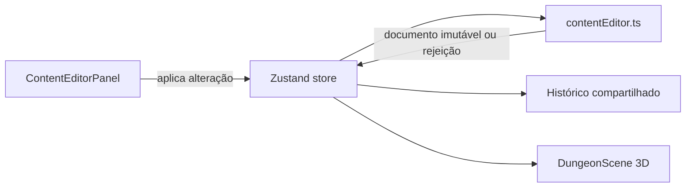

# BATCH-006 — Editor de entidades e conteúdo

Estado: `DONE`

Issue: [#22](https://github.com/EmanuelSena101/DDivination/issues/22)

Pull Requests:
[implementação #23](https://github.com/EmanuelSena101/DDivination/pull/23) e
[encerramento #24](https://github.com/EmanuelSena101/DDivination/pull/24)

## Contexto

A BATCH-005 entregou edição da topologia do mapa e um histórico local
reversível. O mestre ainda não consegue ajustar narrativa, nomes ou os objetos
que compõem a cena sem alterar o documento manualmente.

## Objetivo

Permitir a edição local e imediata do conteúdo bilíngue e das entidades do andar
ativo, mantendo o documento semântico como fonte da cena 3D.

## Escopo

- modo de conteúdo integrado ao editor do mestre;
- edição de nome, resumo, gancho, objetivo, antagonista e atmosfera em pt-BR e
  en-US;
- edição do nome do andar ativo;
- listagem e seleção das entidades do andar;
- criação de prop, luz, armadilha, marcador, token e boss;
- edição de nome, família visual, posição, bloqueio de movimento e visibilidade;
- remoção protegida por confirmação;
- validação de coordenadas e existência do tile;
- atualização imediata dos modelos na cena;
- integração com o histórico compartilhado de undo/redo e descarte;
- bloqueio durante sessão LAN;
- testes unitários, E2E, documentação e QA visual.

## Fora do escopo

- persistência, autosave, checkpoints e optimistic locking, na BATCH-007;
- edição completa de salas, encontros, tesouros ou análise;
- movimentação livre por drag-and-drop;
- upload, catálogo e LOD de GLB, na BATCH-014;
- edição colaborativa durante sessão LAN;
- recalcular automaticamente progressão e budgets após a edição.

## Decisões

- Grid e conteúdo compartilham um único rascunho e histórico de documentos
  completos.
- O painel aplica alterações explicitamente; digitar não cria dezenas de
  checkpoints intermediários.
- Entidades continuam referenciando famílias visuais sem armazenar meshes.
- Uma entidade só pode ocupar coordenadas dentro do mapa que possuam tile.
- Identificadores novos são gerados no cliente para o rascunho e serão
  substituídos por uma estratégia persistente na BATCH-007.

## O que foi entregue

### Narrativa e metadados

No modo **Conteúdo > História**, o mestre pode editar:

- nome da aventura;
- nome do andar ativo;
- resumo;
- gancho;
- objetivo;
- antagonista;
- atmosfera.

Cada valor possui versões independentes em `pt-BR` e `en-US`. As alterações só
entram no documento ao selecionar **Aplicar alterações**, evitando um item de
histórico por tecla digitada.

### Entidades da cena

No modo **Conteúdo > Entidades**, o mestre pode:

- criar `prop`, `light`, `trap`, `marker`, `token` e `boss`;
- selecionar uma entidade existente;
- alterar nome, tipo, família visual, coordenadas e flags;
- definir se ela bloqueia movimento ou começa oculta;
- remover a entidade após confirmação.

O frontend escolhe uma célula caminhável e desocupada ao criar a entidade. Uma
edição só é aceita quando `x` e `z` são inteiros, estão dentro do mapa e apontam
para um tile existente.

### Histórico compartilhado

Grid, narrativa e entidades modificam o mesmo `AdventureDocument` local. Cada
aplicação válida adiciona um documento imutável ao histórico, preservando:

- até 40 estados anteriores;
- undo e redo na ordem real das operações;
- descarte completo para o documento originalmente carregado;
- bloqueio de abertura de mesa enquanto houver rascunho local.

## Fluxo técnico



O documento semântico continua sendo a fonte de verdade. A Batch 6 não
persiste meshes, geometrias ou buffers WebGL.

## Mapa da implementação

| Arquivo | Responsabilidade |
| --- | --- |
| `apps/web/src/contentEditor.ts` | Operações puras, imutáveis e validação de conteúdo/entidades. |
| `apps/web/src/components/ContentEditorPanel.tsx` | Interface de história, entidades e troca de modo. |
| `apps/web/src/store.ts` | Integração das operações ao rascunho e histórico compartilhado. |
| `apps/web/src/App.tsx` | Orquestração entre os modos Grid e Conteúdo. |
| `apps/web/src/components/DungeonScene.tsx` | Projeção imediata da quantidade e modelos de entidades. |
| `apps/web/src/i18n.ts` | Textos do editor em `pt-BR` e `en-US`. |
| `apps/web/src/contentEditor.test.ts` | Testes unitários das operações puras. |
| `apps/web/src/store.test.ts` | Testes do histórico combinado. |
| `apps/web/e2e/content-editor.spec.ts` | Jornada real do mestre no navegador. |

## Como testar manualmente

1. Inicie o projeto com `.\scripts\dev.ps1`.
2. Abra `http://127.0.0.1:5173` e gere uma aventura.
3. Selecione **Editar mapa** e depois **Conteúdo**.
4. Em **História**, altere valores nos dois idiomas e aplique.
5. Em **Entidades**, crie uma entidade, altere seu tipo e posição e aplique.
6. Confirme a mudança de nome na interface e a entidade na cena 3D.
7. Use **Desfazer** e **Refazer** para verificar o histórico compartilhado.
8. Use **Descartar** e confirme o retorno ao documento carregado.
9. Encerre com `.\scripts\stop.ps1`.

Para a validação automatizada completa:

```powershell
.\scripts\test.ps1 -SkipInstall
```

Consulte também o [manual do editor](../GRID_EDITOR.md).

## Critérios de aceitação

- [x] o mestre alterna entre grid e conteúdo no mesmo editor;
- [x] os campos bilíngues principais podem ser alterados;
- [x] o nome do andar ativo pode ser alterado;
- [x] entidades podem ser criadas, selecionadas, editadas e removidas;
- [x] alterações aparecem imediatamente na cena 3D;
- [x] coordenadas inválidas ou sem tile são rejeitadas;
- [x] undo, redo e descarte abrangem grid e conteúdo;
- [x] o editor permanece bloqueado durante sessão LAN;
- [x] testes, documentação, QA visual e CI são aprovados.

## Testes obrigatórios

- Vitest das operações puras de conteúdo e entidade;
- Vitest da integração com o histórico do store;
- Playwright editando narrativa e uma entidade;
- regressão dos E2E existentes;
- `scripts/test.ps1 -SkipInstall`;
- inspeção visual e console do navegador;
- GitHub Actions.

## Riscos

- Campos bilíngues extensos podem ocupar a cena. Mitigação: painel rolável e
  seções compactas.
- Entidades podem ser posicionadas em células inválidas. Mitigação: validar
  bounds e presença de tile antes de alterar o documento.
- O histórico pode crescer. Mitigação: manter o limite de 40 documentos já
  adotado.

## Diário de execução

### 2026-07-30 — início

- Issue #22 criada.
- Branch `codex/batch-006-content-entities` criada a partir de `main` após o
  hotfix LAN/WebSocket.
- Escopo separado da persistência editorial da BATCH-007.

### 2026-07-30 — implementação e validação local

- Criado um módulo puro e imutável para alterações de narrativa e entidades.
- Integrados grid, conteúdo e entidades ao mesmo rascunho e histórico de até 40
  documentos.
- Adicionados modos Grid/Conteúdo, formulários bilíngues, seletor de entidades
  e atualização imediata da cena.
- Acrescentados testes de operações puras, store e um fluxo E2E cobrindo
  narrativa, entidade e undo/redo compartilhado.
- A suíte local aprovou Go, contratos, TypeScript strict, 22 testes Vitest,
  build, budgets e 4 cenários Playwright.
- O bundle permaneceu dentro dos limites: 100,5 KiB inicial, 245,2 KiB do núcleo
  VTT, 819,1 KiB da física dos dados e 1164,7 KiB total.
- A inspeção nos modos História e Entidades confirmou o layout rolável, a
  atualização da cena e nenhum erro no console.
- Pull Request #23 aberta para validação contínua e revisão.

### 2026-07-30 — conclusão

- Os sete jobs do projeto no GitHub Actions foram aprovados: contrato,
  developer workflow, E2E, web e Go em Windows, Linux e macOS.
- A falha externa da Vercel não é gate do projeto: o DDivination é uma
  aplicação local-first distribuída com servidor Go.
- Pull Request #23 integrada à `main`.
- Pull Request #24 integrou o registro final de conclusão à `main`.
- Issue #22 encerrada pela integração.

## Resultado

O mestre pode editar conteúdo bilíngue e entidades sem sair da VTT. Toda
alteração válida atualiza o documento semântico local e participa do mesmo
undo/redo usado pelo grid.

## Pendências encontradas

- O painel precisa ser rolável em telas menores; o comportamento foi preservado
  intencionalmente para não reduzir a área útil da cena.
- O rascunho ainda não sobrevive a recarregamento ou encerramento. A correção
  pertence à BATCH-007.
- Edição completa de salas, encontros, tesouros e análise não foi incorporada
  silenciosamente; continua fora do escopo desta batch.
- Upload e pipeline completo de GLB continuam reservados à BATCH-014.

## Documentação atualizada

- [x] documento desta batch;
- [x] `docs/STATUS.md`;
- [x] manual do editor;
- [x] arquitetura;
- [x] README.
